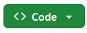

# A set of the standard plugins we use when setting up a new WordPress site
Click on the  button then click "Download .zip file" and simply drag and drop all contents into /wp-content/.

## WARNING: Do **NOT** Update UltimateMember or the site will stop working
All other plugins can be updated normally.

For any questions contact tefkros at info@tefkros.com or https://tefkros.com
